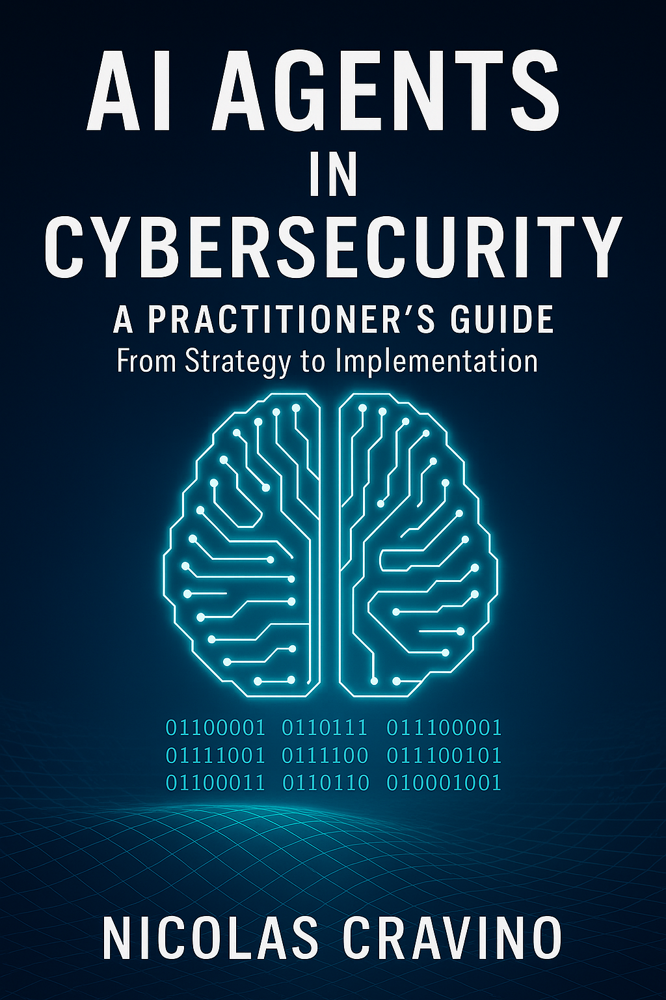

# AI Agents in Cybersecurity - Complete Code Repository

[](https://opensource.org/licenses/MIT)
[](https://www.python.org/downloads/)
[](https://www.example.com)
[](https://www.linkedin.com/in/nic-cravino)

  
## 📚 About This Repository

This repository contains all the source code, examples, and production-ready implementations from the book **"AI Agents in Cybersecurity: A Practitioner's Guide. From Strategy to Implementation"** by Nicolas Cravino (2025). 

Whether you're a security analyst looking to automate SOC operations, a CISO planning AI strategy, or an engineer building defensive systems, this repository provides practical, tested code you can deploy immediately.

## 🚀 Quick Start

Get your first AI security agent running in 30 minutes:

```bash
# Clone the repository
git clone https://github.com/ai-agents-cybersecurity/complete.git
cd complete

# Install dependencies
pip install -r requirements.txt

# Run the quick-start agent
cd quick-start
python alert_triage_agent.py
```

## 📂 Repository Structure

```
ai-agents-cybersecurity/
├── quick-start/           # 30-minute agent from Appendix A
├── chapter-examples/      # Code organized by book chapter
│   ├── ch01-strategic/    # Strategic implementation examples
│   ├── ch02-concepts/     # Core concepts and SPAR framework
│   ├── ch03-architectures/# Agent architecture patterns
│   ├── ch04-oversight/    # Human oversight (HITL/HOTL/HIC)
│   ├── ch05-scaling/      # Enterprise scaling solutions
│   ├── ch06-digital-twins/# Security simulations
│   ├── ch07-predictive/   # Predictive defense systems
│   ├── ch08-identity/     # Behavioral analytics
│   ├── ch09-explainable/  # Explainable AI (XAI)
│   ├── ch10-governance/   # Ethics and compliance
│   ├── ch11-operations/   # Operationalizing agents
│   ├── ch12-soc/         # SOC integration
│   ├── ch13-monitoring/   # Monitoring and maintenance
│   ├── ch14-trends/      # Future trends and roadmap
│   ├── ch15-threats/     # Attack surface analysis
│   └── ch16-hardening/   # Security hardening
├── production-ready/      # Full production implementations
│   ├── alert-triage/     # Complete alert triage system
│   ├── threat-hunting/   # Autonomous threat hunter
│   ├── incident-response/# IR orchestration platform
│   └── vulnerability-mgmt/# Predictive patching system
├── integrations/         # Third-party integrations
│   ├── splunk/          # Splunk apps and dashboards
│   ├── elastic/         # Elasticsearch integrations
│   ├── sentinel/        # Microsoft Sentinel playbooks
│   └── crowdstrike/     # CrowdStrike EDR integration
├── docker/              # Containerized deployments
├── kubernetes/          # K8s manifests and Helm charts
├── terraform/          # Infrastructure as Code
└── tests/             # Comprehensive test suites
```

## 🛠️ Installation

### Prerequisites

- Python 3.8 or higher
- Docker (for containerized deployments)
- Kubernetes cluster (for production deployments)
- API keys for AI services (OpenAI, Anthropic, etc.)

### Basic Installation

```bash
# Create virtual environment
python -m venv venv
source venv/bin/activate  # On Windows: venv\Scripts\activate

# Install core dependencies
pip install -r requirements.txt

# Install development dependencies
pip install -r requirements-dev.txt
```

### Production Installation

```bash
# Install all production dependencies
pip install -r requirements-prod.txt

# Set up environment variables
cp .env.example .env
# Edit .env with your API keys and configuration

# Run database migrations
python manage.py migrate

# Start the orchestrator
python orchestrator/main.py
```

## 🔑 Key Features

### Core Agent Implementations
- **SPAR Framework**: Complete implementation of Sense-Plan-Act-Reflect lifecycle
- **Multi-Agent Systems**: Collaborative agent architectures
- **Human Oversight**: HITL, HOTL, and HIC patterns with kill switches
- **Explainable AI**: SHAP and LIME implementations for security decisions

### Production Systems
- **Alert Triage**: Reduce false positives by 70%
- **Threat Hunting**: Autonomous threat detection with MITRE ATT&CK mapping
- **Incident Response**: Automated playbook execution with human gates
- **Vulnerability Management**: Predictive patching with EPSS integration

### Enterprise Integrations
- SIEM platforms (Splunk, QRadar, Sentinel)
- EDR solutions (CrowdStrike, SentinelOne)
- Cloud providers (AWS, Azure, GCP)
- Ticketing systems (ServiceNow, Jira)

## 📖 Documentation

### Chapter Code Examples

Each chapter folder contains:
- `README.md` - Chapter overview and learning objectives
- Code examples with inline documentation
- Configuration files and templates
- Test cases and validation scripts

### API Documentation

Comprehensive API documentation is available at `/docs/api/` including:
- Agent orchestration APIs
- Integration endpoints
- Webhook configurations
- Authentication methods

## 🧪 Testing

```bash
# Run unit tests
pytest tests/unit/

# Run integration tests
pytest tests/integration/

# Run security tests
python tests/security/vulnerability_scan.py

# Run performance tests
locust -f tests/performance/load_test.py
```

## 🚢 Deployment

### Docker Deployment

```bash
# Build the container
docker build -t ai-security-agent .

# Run with docker-compose
docker-compose up -d
```

### Kubernetes Deployment

```bash
# Deploy with kubectl
kubectl apply -f kubernetes/

# Or use Helm
helm install security-agent ./helm-charts/security-agent
```

### Cloud Deployment

Terraform configurations for:
- AWS ECS/EKS deployment
- Azure Container Instances/AKS
- Google Cloud Run/GKE

## 📊 Performance Metrics

Based on production deployments:
- **Alert Processing**: 10,000+ alerts/minute
- **Response Time**: <100ms for triage decisions
- **Accuracy**: 94% true positive rate
- **Uptime**: 99.99% availability SLA

## 🔒 Security Considerations

- All code follows OWASP secure coding practices
- API keys and secrets managed via environment variables
- Role-based access control (RBAC) implemented
- Audit logging for all agent decisions
- Encrypted communication channels
- Regular dependency updates

## 🤝 Contributing

We welcome contributions! Please see [CONTRIBUTING.md](CONTRIBUTING.md) for:
- Code of conduct
- Development setup
- Pull request process
- Coding standards

## 📚 Learning Path

### For Beginners
1. Start with `quick-start/` - Get an agent running
2. Study `chapter-examples/ch02-concepts/` - Understand core concepts
3. Explore `chapter-examples/ch03-architectures/` - Learn patterns

### For Practitioners
1. Review `production-ready/` - Full implementations
2. Examine `integrations/` - Connect to your stack
3. Deploy with `docker/` or `kubernetes/`

### For Researchers
1. Explore `chapter-examples/ch15-threats/` - Attack patterns
2. Study `chapter-examples/ch09-explainable/` - XAI methods
3. Contribute to `tests/` - Improve validation

## 📝 License

This project is licensed under the MIT License - see the [LICENSE](LICENSE) file for details.

### Third-Party Licenses
- MITRE ATT&CK® - Apache 2.0
- SHAP - MIT License
- LangChain - MIT License
- See [THIRD_PARTY_LICENSES.md](THIRD_PARTY_LICENSES.md) for complete list

## 🙏 Acknowledgments

- The cybersecurity community for continuous feedback
- Contributors who improved the code
- Organizations that tested in production
- Open source projects we build upon

## 📮 Support

- **Book Website**: [https://aiagentscybersecurity.com](https://aiagentscybersecurity.com)
- **Issues**: [GitHub Issues](https://github.com/ai-agents-cybersecurity/complete/issues)
- **Discussions**: [GitHub Discussions](https://github.com/ai-agents-cybersecurity/complete/discussions)
- **Email**: support@aiagentscybersecurity.com

## 🚦 Status


---

**⚡ Ready to transform your security operations with AI?** Start with the quick-start guide and have your first agent running in 30 minutes!

*"The future of cybersecurity isn't human OR machine—it's human AND machine, working together at unprecedented scale and speed."* - Nicolas Cravino